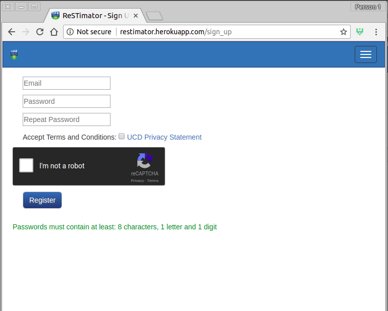
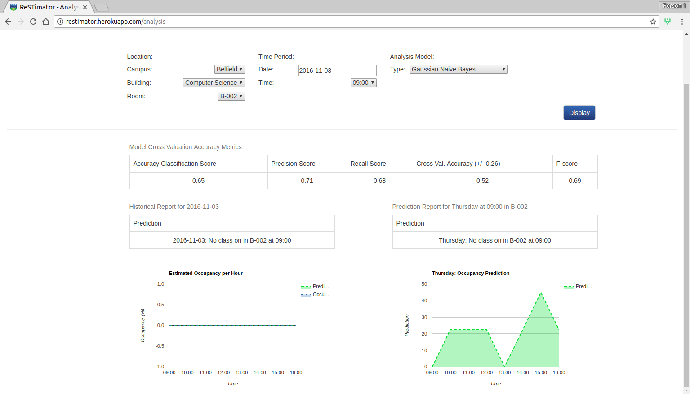

## Things I've made

* [chrome-compare](https://chrome.google.com/webstore/detail/chrome-compare/fbojbhlkngpihcjhjhadacdfikocgjfe) 
  * A google-chrome extension to compare the same page accross multiple sites (js) 
  * [View Source Code](https://github.com/ConorSheehan1/chrome-compare)

+ test
--------------- 
  * [https://conorsgapminder.herokuapp.com](https://conorsgapminder.herokuapp.com) 
    * visualization of GDP and life expectancy of countries (d3.js) 
    * [View Source Code](https://github.com/ConorSheehan1/InfoVisD3)
    
  * [https://conorsworldmap.herokuapp.com](https://conorsworldmap.herokuapp.com)
    * visualization of GDP grouped by government type, using (d3.js, datamaps)  
    * [View Source Code](https://github.com/ConorSheehan1/InfoVisD3)

## College Projects

* [https://dubbikesmap-api-heroku.herokuapp.com/](https://dubbikesmap-api-heroku.herokuapp.com/)  
  * Dublin Bikes WebApp built on jcdecaux api  
  * [View Source Code](https://github.com/ConorSheehan1/dublin_bikes)

* [http://restimator.herokuapp.com](http://restimator.herokuapp.com)  
  * Estimating the occupancy of rooms in the UCD computer science building based on WiFI logs (flask, scikit, pandas)  
  * [View Source Code](https://github.com/ConorSheehan1/ReSTimator_Team1100)

